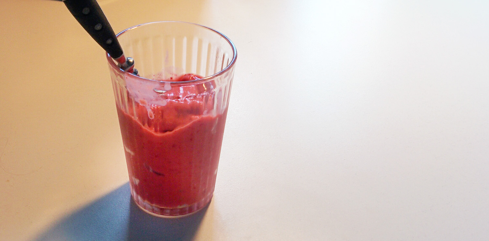

> Hi! This shell of a recipe is just here to make the demo index page look a bit less empty. Watch [this video](https://www.youtube.com/watch?v=v2L4u2H2Hw0) if you actually want to cook it!

## Actually, let's demo some features!

---

> If you're reading this "recipe" on the demo site or GitHub, it might be instructive to look at the [source code](https://raw.githubusercontent.com/doersino/nyum/main/_recipes/kkaennipjeon.md) as well.

---

> As you've just seen, you can use level-2 headings to subdivide a recipe into different parts – that's handy if, say, a recipe describes how to make a thing *and* a sauce for that thing.
>
>>> Due to limitations described [here](https://github.com/doersino/nyum/issues/1#issuecomment-806698849), you can't have a heading right at the start of a recipe. For the same reason, *don't precede* a heading with a horizontal rule, but *do* add one after it (basically, just do it the way it's done here).

---

* `500 ml` water

> As shown in the previous "step", three nested blockquotes can help you draw attention to (part of) an instruction. If there was a need to, say, bring half a liter of water to a rolling boil, it might be appropriate to warn the reader:
>
>>> Don't burn the water!
>
> Or something slightly more sensible like that.

---

> Of course, the standard Markdown styling features are also at your disposal – **bold**, *italic*, and ~~strike-through~~, just to name a few. [Links](strawberrysmoothie.html) and images can be embedded in the usual way.
>
> 
>
> <marquee>Inline HTML, while inelegant (*especially* this tag), works too!</marquee>
